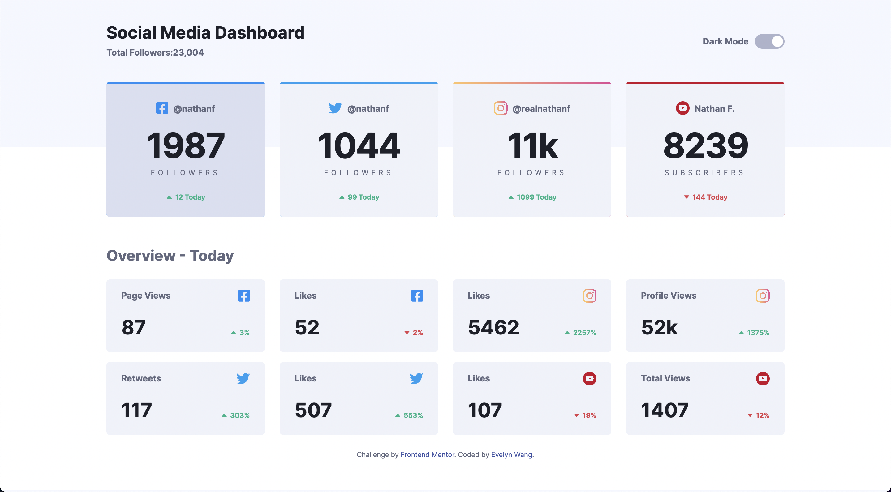
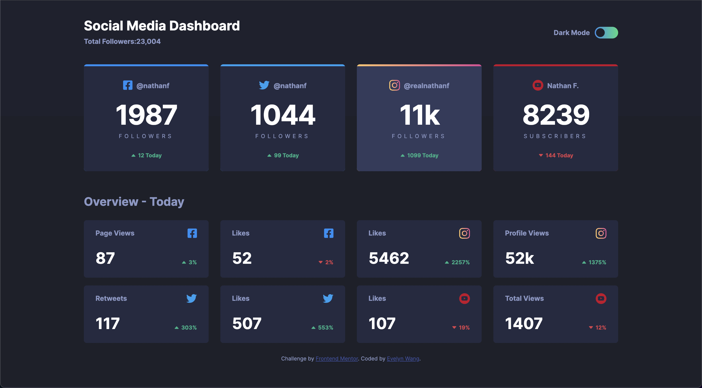

# Frontend Mentor - Social media dashboard with theme switcher solution

This is a solution to the [Social media dashboard with theme switcher challenge on Frontend Mentor](https://www.frontendmentor.io/challenges/social-media-dashboard-with-theme-switcher-6oY8ozp_H). Frontend Mentor challenges help you improve your coding skills by building realistic projects.

## Table of contents

- [Overview](#overview)
  - [The challenge](#the-challenge)
  - [Screenshot](#screenshot)
  - [Links](#links)
- [My process](#my-process)
  - [Built with](#built-with)
  - [What I learned & useful resources](#what-i-learned)
  - [Continued development](#continued-development)

## Overview

### The challenge

Users should be able to:

- View the optimal layout for the site depending on their device's screen size
- See hover states for all interactive elements on the page
- Toggle color theme to their preference

### Screenshot

<figure>

<figcaption align="center">desktop active state light</figcaption>
</figure>

<figure>

<figcaption align="center">desktop active state dark</figcaption>
</figure>

### Links

- Solution URL: [My Solution](https://github.com/evelyn-2022/social-media-dashboard)
- Live Site URL: [Github Page](https://evelyn-2022.github.io/social-media-dashboard/)

## My process

### Built with

- HTML5 markup
- CSS custom properties
- Bootstrap
- SCSS
- jQuery

### What I learned & useful resources

- How to create a [theme switcher](https://www.youtube.com/watch?v=D1yg4T37qYo&list=PLFatWG5b83quGPEcTPYw8iJHXfjlwdL-S&index=8) with checkbox
- [How to use svg files](https://www.youtube.com/watch?v=ZJSCl6XEdP8&list=PLFatWG5b83quGPEcTPYw8iJHXfjlwdL-S&index=9), and the differences between [viewport and viewbox](https://www.youtube.com/watch?v=TBYJ2V1jAlA&list=PLFatWG5b83quGPEcTPYw8iJHXfjlwdL-S&index=11)
- [Add gradient background to svg](https://stackoverflow.com/questions/14051351/svg-gradient-using-css)
- [Use bootstrap and SCSS to customize your page](https://www.youtube.com/watch?v=iJKCj8uAHz8&list=PLFatWG5b83quGPEcTPYw8iJHXfjlwdL-S&index=6&t=15973s)
- [How to use npm](https://www.youtube.com/watch?v=jHDhaSSKmB0&list=PLFatWG5b83quGPEcTPYw8iJHXfjlwdL-S&index=1)

### Continued development

Use APIs to generate data instead of hard coding.
